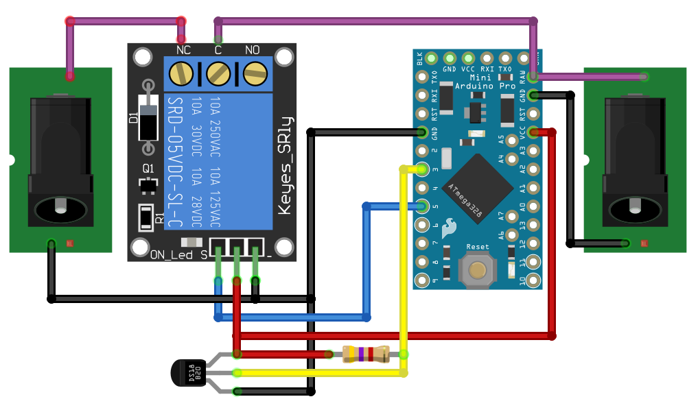
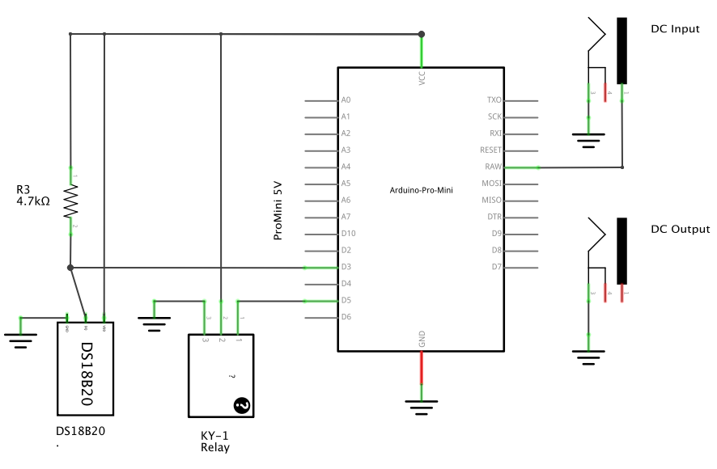
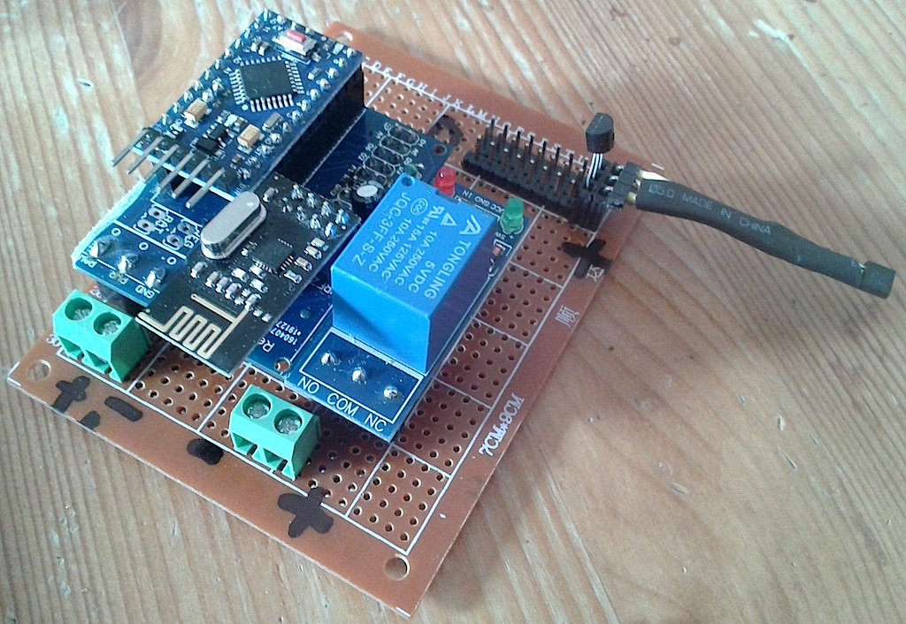
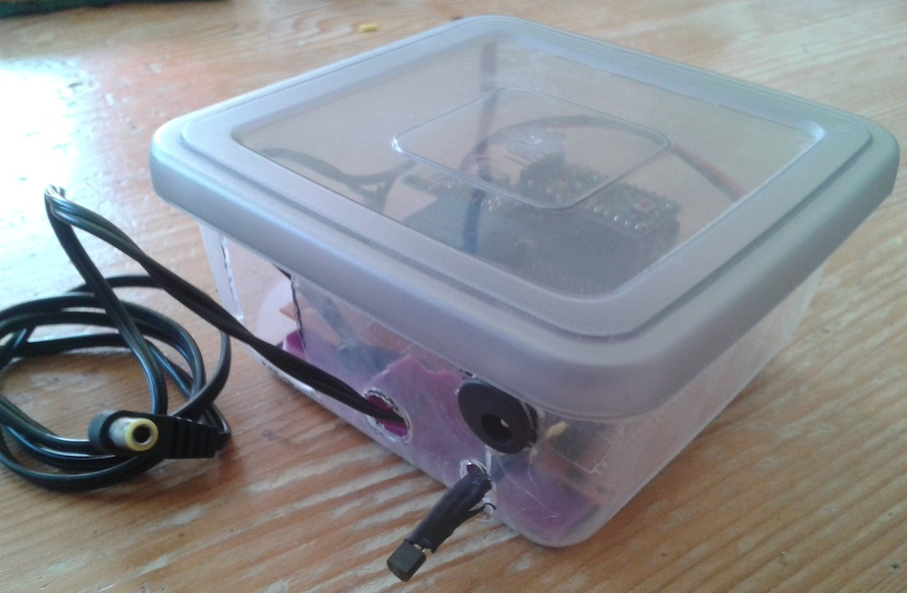

# MySensors Freebox Relay

This Arduino ProMini (5V) based project is a [MySensors](https://www.mysensors.org/)  node which controls the power supply of a Freebox (Modem for FREE, a French ISP) using a relay, in order to be able to remotely power it off, reboot it and/or perform a firmware upgrade.

## Features
- Modes : power on, power off, reboot, firmware upgrade (power on/off 4 times)
- Prevents powering off while currently rebooting or firmware upgrading
- Senses the room temperature using a DS18B20
- Large OneWire bus to optionally sense temperatures of nearby devices (ie: computers, switches, routers, etc...)

## Wiring
*The radio wiring is not represented here. Refer to [this MySensor page](https://www.mysensors.org/build/connect_radio).*

## Schematic
*Due to the limited Fritzing relay part used, the Relay output is not represented here, please refer to the above wiring image.*

## Images
*I've used the excellent [sundberg84's PCB](https://www.openhardware.io/view/4/EasyNewbie-PCB-for-MySensors)  which really eases the whole wiring.*

## License

This program is free software; you can redistribute it and/or modify it under the terms of the GNU General Public License as published by the Free Software Foundation; either version 2 of the License, or (at your option) any later version.

This program is distributed in the hope that it will be useful, but WITHOUT ANY WARRANTY; without even the implied warranty of MERCHANTABILITY or FITNESS FOR A PARTICULAR PURPOSE.  See the GNU General Public License for more details.

You should have received a copy of the GNU General Public License along with this program; if not, write to the Free Software Foundation, Inc., 51 Franklin Street, Fifth Floor, Boston, MA 02110-1301 USA.
